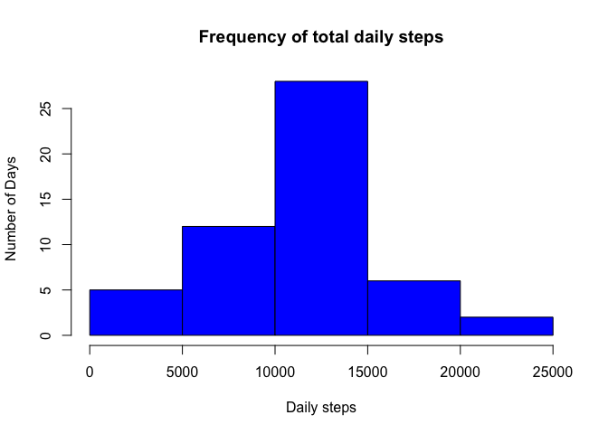
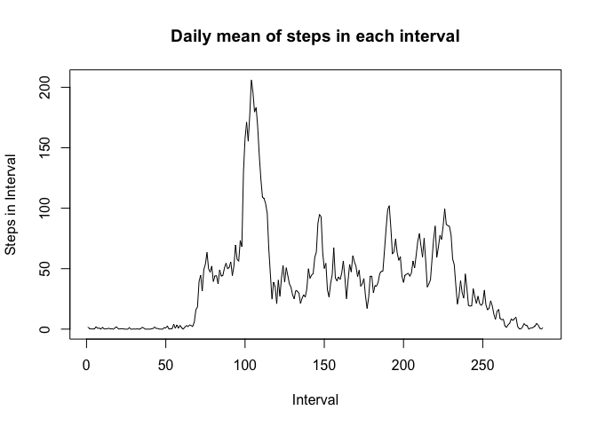
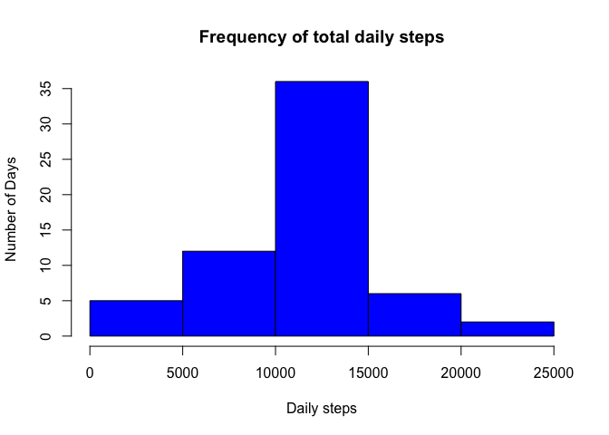
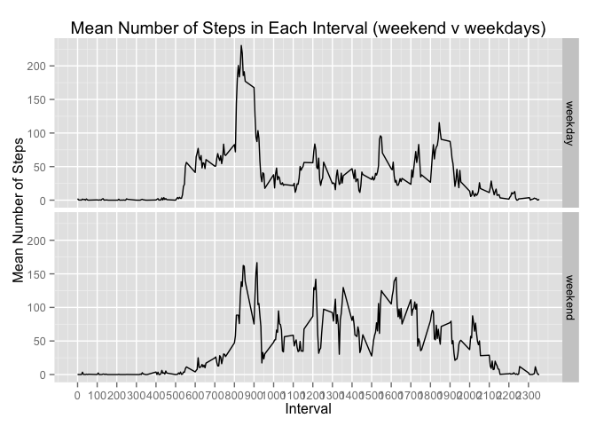

# Reproducible Research: Peer Assessment 1


## Loading and preprocessing the data

```r
library(data.table)
library(lubridate)
```

```
## 
## Attaching package: 'lubridate'
## 
## The following objects are masked from 'package:data.table':
## 
##     hour, mday, month, quarter, wday, week, yday, year
```

```r
library(dplyr)
```

```
## 
## Attaching package: 'dplyr'
## 
## The following objects are masked from 'package:lubridate':
## 
##     intersect, setdiff, union
## 
## The following objects are masked from 'package:data.table':
## 
##     between, last
## 
## The following object is masked from 'package:stats':
## 
##     filter
## 
## The following objects are masked from 'package:base':
## 
##     intersect, setdiff, setequal, union
```

```r
library(ggplot2)

# Set working sub directory to keep files together
mainDir <- getwd()
subDir <- "RepData_PeerAssessment1"

if (file.exists(subDir)){
    setwd(file.path(mainDir, subDir))
} else {
    dir.create(file.path(mainDir, subDir))
    setwd(file.path(mainDir, subDir))    
}

# download file, unzip and load data
if (!file.exists("./activity.csv")) {
    download.file("http://d396qusza40orc.cloudfront.net/repdata%2Fdata%2Factivity.zip",
                  method='curl', 
                  destfile="./activity.zip"
    )
    allData <-  unzip("./activity.zip",exdir = getwd())
    allData <- "./activity.csv"
} 

activityDT <- fread("./activity.csv", sep="auto", 
                    header="auto", na.strings=c("NA"), 
                    stringsAsFactors=FALSE, verbose=FALSE)
activityDT$date <- as.Date(ymd(activityDT$date))
```


## What is mean total number of steps taken per day?

```r
# Calculate total number of steps taken per day
dailyTsteps <- tapply(activityDT$steps, activityDT$date, sum)

# Create Histogram of total number of steps taken per day
hist(dailyTsteps, main="Frequency of total daily steps", 
    xlab="Daily steps", ylab="Number of Days", col="blue")
```

 

```r
# Calculate the mean of total steps taken per day
mean(dailyTsteps, na.rm=T)
```

```
## [1] 10766.19
```

```r
# Calculate the median of total steps taken per day
median(dailyTsteps, na.rm=T)
```

```
## [1] 10765
```

## What is the average daily activity pattern?

```r
# Plot the mean interval activity pattern for all dates
intervalMsteps <- tapply(activityDT$steps, activityDT$interval, mean, na.rm=T)

plot(intervalMsteps, type="l", main=("Daily mean of steps in each interval"), 
     ylab="Steps in Interval", xlab="Interval")
```

 

```r
# Name the interval with the largest average number of steps and the average number of steps in that interval 
which.max(intervalMsteps)
```

```
## 835 
## 104
```

## Imputing missing values

```r
# Count the total number of missing values
sum(is.na(activityDT$steps))
```

```
## [1] 2304
```

```r
## Impute the missing values in the dataset using the mean interval value

    # Create a vector for the mean of each interval
    intervalMsteps_vector <- as.vector(intervalMsteps)
    
    # Loop for all 61 days
    intervalMsteps_vector <- rep(intervalMsteps_vector, 61)
    
    # Replace non-missing values in vector with 0
    intervalMsteps_vector[!is.na(activityDT$steps)] = 0
    
    # Create a vector for the steps of each interval
    allStepsVector <- as.vector(activityDT$steps)
    
    # Replace missing values in vector with 0
    allStepsVector[is.na(allStepsVector)] = 0
    
    # Add the two vectors together at the row level and place back into data table
    activityDT_imputed <- activityDT
    activityDT_imputed$steps <- intervalMsteps_vector + allStepsVector

# Calculate total number of steps taken per day on imputed data set
dailyTsteps_imputed <- tapply(activityDT_imputed$steps, activityDT_imputed$date, sum)

# Create Histogram of total number of steps taken per day on imputed data set
hist(dailyTsteps_imputed, main="Frequency of total daily steps", 
     xlab="Daily steps", ylab="Number of Days", col="blue")
```

 

```r
# Calculate the mean of total steps taken per day
mean(dailyTsteps_imputed, na.rm=T)
```

```
## [1] 10766.19
```

```r
# Calculate the median of total steps taken per day
median(dailyTsteps_imputed, na.rm=T)
```

```
## [1] 10766.19
```

## Are there differences in activity patterns between weekdays and weekends?

```r
# Set Weekend and Weekday categories in new vector in the data frame
dayType <- factor(weekdays(activityDT_imputed$date) %in% c("Saturday","Sunday"), 
               labels=c("weekday","weekend"), ordered=FALSE)

activityDT_imputed[, c("dayType") := dayType]
```

```
##            steps       date interval dayType
##     1: 1.7169811 2012-10-01        0 weekday
##     2: 0.3396226 2012-10-01        5 weekday
##     3: 0.1320755 2012-10-01       10 weekday
##     4: 0.1509434 2012-10-01       15 weekday
##     5: 0.0754717 2012-10-01       20 weekday
##    ---                                      
## 17564: 4.6981132 2012-11-30     2335 weekday
## 17565: 3.3018868 2012-11-30     2340 weekday
## 17566: 0.6415094 2012-11-30     2345 weekday
## 17567: 0.2264151 2012-11-30     2350 weekday
## 17568: 1.0754717 2012-11-30     2355 weekday
```

```r
#Calculate the mean for each interval for weekdays and weekends
weekdayTypeIntervalMsteps <- activityDT_imputed %>% group_by(interval, dayType) %>% summarise(meanSteps = mean(steps, na.rm=T))

partitionPlot <- ggplot(data=weekdayTypeIntervalMsteps, mapping=aes(x=interval, y=meanSteps)) + geom_line() + facet_grid(dayType ~ .) + scale_x_continuous("Interval", 
                        breaks=seq(min(weekdayTypeIntervalMsteps$interval), 
                        max(weekdayTypeIntervalMsteps$interval), 100)) + scale_y_continuous("Mean Number of Steps") + ggtitle("Mean Number of Steps in Each Interval (weekend v weekdays)")

partitionPlot
```

 
